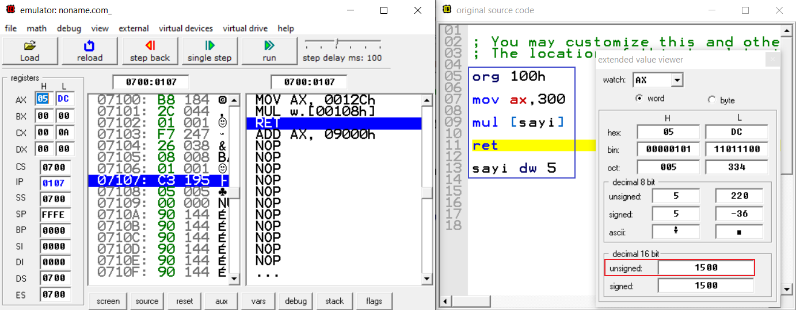

# Aritmetik Komutlar 

## Toplama(ADD-ADC)

ADD toplama, ADC elde ile toplamadır. ADD ile tek farkı elde bayrağının da(CF) eklenmesidir.

```
ADD deger1,deger2   ; deger1 = deger1 + deger2
```
Buradaki mantık basittir deger1 ile deger2 toplanıp, deger1 içerisine aktarılır.

ADD komutu bayrakları etkiler.

## ADD komutunun kullanım şekilleri
```
deger1,deger2

REG,memory
memory,REG
REG,REG
memory,immediate
REG,immediate
```
## Dikkat Edilmesi Gerekenler

1-Dikkat edilecek en önemli konu bu işlemleri yaparken kullanılacak registerlerin seçimidir. Örneğin işlemin 8 bit sınırlarını aşmayacağı biliniyorsa 8 bitlik registerlar kullanılabilir.

2-Herhangi bir şekilde 8 bit sınırı aşılırsa Overflow Flag(OF) ve Carry Flag(CF) aktif olur.

## Örnekler


al registerindeki değer ile bl registeri içerisindeki deger toplanıp al registeri içerisine aktarıldı. 8 bit sınırı aşılmadığı için 8 bitlik registerlerin kullanılması sorun oluşturmaz. Yukarıdaki örnek register, register şeklinde kullanıma örnektir. Başka örneklere bakacak olursak;

**memory, register şeklinde kullanımı;**
```
org 100h

mov al,20  
add [sayi],al

ret
sayi db 4   
```
`sayi = 24`

**register, immediate şeklinde kullanımı;**
```
org 100h

mov al,5  
add al,12   

ret
```
`al = 17`

**memory, immediate şeklinde kullanımı;**
```
org 100h
  
add [sayi],4   

ret
sayi db 4   
```
`sayi = 8`

## ADC ile Toplama İşlemi

ADC ile eldeli toplamaya gelecek olursak ADD için geçerli olan tüm durumlar burada da geçerli. Yukarıda belirttiğimiz gibi tek fark Carry Flag(CF)'in işin içine girmesidir. 

```
ADD deger1,deger2   ; deger1 = deger1 + deger2 + CF
```
ADC komutu bayrakları etkiler.

## Çıkarma(SUB-SBB)

SUB ve SBB ikisi de çıkarma işlemi gerçekleştirmek için kullanılır. Aralarındaki temel fark SUB ile çıkarma işlemi yapılırken çıkarma işlemine CF dahil edilmez. SBB ile çıkarma işlemi yapılırken çıkarma işlemine CF de dahil edilir.

```
SUB deger1,deger2   ; deger1 = deger1 - deger2
```
Buradaki mantık basittir deger1 ile deger2 çıkarılır, deger1 içerisine aktarılır.

SUB komutu bayrakları etkiler.


## SUB komutunun kullanım şekilleri
```
deger1,deger2

REG,memory
memory,REG
REG,REG
memory,immediate
REG,immediate
```

## Örnekler


al registeri içerisindeki 8 değerinden 3 çıkarılır ve sonuç al registerine tekrardan yazilir. Yukarıdaki örnek register, immediate şeklinde kullanıma örnektir. Bir başka örnek olarak register, register şeklindeki kullanımına bakalım;

```
org 100h

mov al,8 
mov bl,3 
sub al,bl   

ret
```
`al = 5`

## SBB ile Çıkarma işlemi 

SBB ile çıkarma işlemine gelecek olursak SUB için geçerli olan tüm durumlar burada da geçerli. Yukarıda belirttiğimiz gibi tek fark Carry Flag(CF)'in işin içine girmesidir. 

```
SBB deger1,deger2   ; deger1 = deger1 - deger2 - CF
```
SBB komutu bayrakları etkiler.

## Örnek


Bu örneği açıklayacak olursak al'ye 3 değeri atandı, daha sonra sub ile çıkarma işlemi yapıldı ve 6 çıkarıldı. Bu sırada al değeri FD(253) oldu ve carry flag değeri 1 oldu. En son aşamada sbb ile çıkarma işlemi yapıldı ve 2 çıkarıldı. Normal şartlarda 253 - 2 = 251 olması gerekiyor fakat işin içine carry flag de dahil oldu ve 253 - 2 - 1 = 250 oldu. Carry flag ise 0 değerini aldı.

## Çarpma(MUL-IMUL)

MUL ve IMUL çarpma işlemi için kullanılır. Aralarındaki fark  IMUL işaretli(signed) sayılarda çarpma işlemi için kullanılır.

```
MUL deger1   

; 8 bit için AX = AL * değer1 

; 16 bit için (DX AX) = AX * deger1
```

8 bitlik işlemlerde MUL komutuna verdiğimiz değer ile al registerisi ile çarpılıp ax registerisi içerisine aktarılır. 16 bitte ise deger ax registerisi ile çarpılıp ax registerisi içerisine aktarılır genişleme değeri ise dx registerisi içerisine aktarılır. 

MUL komutu bayrakları etkiler. Eğer sonucun yüksek değerli bölümü 0 olduğu zaman Carry Flag ve Overflow flag  0 olur.

## MUL komutunun kullanım şekilleri
```
deger1

REG
memory
```

## Örnekler


Bu örnekte görüldüğü üzere bl registerisi ile al registerisi çarpılarak ax registerisi içerisine yerleştirildi.



16 bitle işlem yapıldığında bulunan sonuş dx ve ax registerleri içerisinde tutuluyor. Burada sonuç direkt ax registeri içerisinde gözüküyor. dx registerisi, çarpma sonrasında oluşan genişleme değerini tutar. Herhangi bir genişleme olmadığı için 0 durumundadır.

## IMUL ile Çarpma İşlemi

IMUL ile çarpma işlemine gelecek olursak yukarıda bahsettiğimiz gibi işaretli(signed) sayılarda çarpma işlemi için kullanılır. Yukarıdaki MUL komutu için verilmiş kalıplar
kullanılabilir. Sonuç 8 bit ve 16 bit arasında olduğu durumlarda Carry Flag ve Overflow flag  0 olur.

## Örnek


bl registerisi değeri 2 iken 4 eksiliyor ve işaretli(signed) sayılarda -2 oluyor. Daha sonra al registerisine 5 aktarılıyor. 5 * (-2) = -10 cevabını buluyoruz.

## Bölme(DIV-IDIV)

DIV ve IDIV bölme işlemi için kullanılır. Aralarındaki fark IDIV işaretli(signed) sayılarda bölme işlemi için kullanılır.

```
DIV deger1   

; 8 bit için AL = AX / değer1   ; AH ise Kalan(MOD)

; 16 bit için AX = (DX AX) / deger1    ; DX ise Kalan(MOD)
```

8 bitlik işlemlerde DIV komutuna verdiğimiz değer ile ax registerisi ile bölünüp al registerisi içerisine aktarılır. Kalan ise ah registerisinde saklanır. 16 bitte ise deger (dx ax) registerleri ile bölünüp ax registerisi içerisine aktarılır kalan ise dx registerisi içerisinde tutulur.

DIV komutunda bayraklar tanımsızdır.

## Örnek


bl registerisi içerisindeki 5, ax registerisi içerisindeki 51 ile bölme işlemine tabii tutuldu. 51 / 5 = 10 kalan ise 1.

Buradaki örnekte gözüktüğü üzere elde edilen sonuç yani bölüm al registerinde  kalan ise ah registerinde görülmektedir.

## IDIV ile Bölme İşlemi

IDIV ile bölme işlemine gelecek olursak yukarıda bahsettiğimiz gibi işaretli(signed) sayılarda bölme işlemi için kullanılır. Yukarıdaki DIV komutu için verilmiş kalıplar
kullanılabilir. 

## Örnek


Özetle (-182) / 9 = (-20) kalan ise -2 burada kalan aynı şekilde AH registerisi içerisinde gösterilirken bölüm AL registerisi içerisinde gösterilmiştir.

## CBW(tamamlanacak)

## CWD(tamamlanacak)