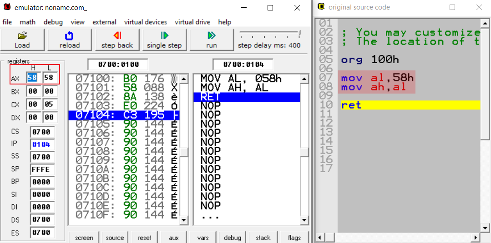
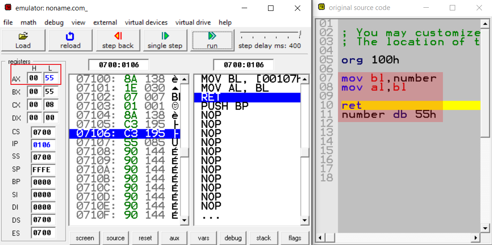

# Temel Assembly Komutları

## MOV Komutu

MOV komutunun temel işlevi kopyalamaktır. Kaynaktan hedefe doğru bir kopyalama işlemi yapar. MOV komutu bayrakları etkilemez.

```
MOV hedef,kaynak
```

Buradaki hedef verilerin aktarılacağı adresi, kaynak ise aktarılacak olan veriyi ifade etmektedir. Bu aktarım yapılırken kaynaktaki değer kaybolmaz.

### MOV komutunun kullanım şekilleri
```
hedef,kaynak

REG,memory
memory,REG
REG,REG
memory,immediate
REG,immediate
SREG,memory
memory,SREG
REG,SREG
SREG,REG
```
## Dikkat Edilmesi Gerekenler

1-Hafızanın bir konumunda diğer bir konumuna doğrudan taşıma
yapamazsınız. 

```
MOV memory,memory    -> yanlış bir kullanımdır.
```

Bu işlemi yapmak için taşınacak veri önce register'lardan birine aktarılmalıdır.

2-Hedef ve kaynak eşit boyutlarda olmak zorundadır. Biri 8 bit register iken diğeri 16 bit register olamaz.

```
MOV ax,al   -> yanlış bir kullanımdır.
MOV ax,bx   -> doğru bir kullanımdır.
``` 

3-Bir segment register değeri başka bir segment register içerisine direkt olarak atanamaz. Öncelikle genel kaydedicilere veri yüklenmelidir. Ayrıca segment kaydedicilere doğrudan bir veri taşıyamayız.

```
MOV ds,es   -> yanlış bir kullanımdır.
MOV ds,654h -> yanlış bir kullanımdır.
```  
4-Segment kaydedicilerine sadece
16 bitlik boyutunda değerler yüklenebilir. Genel kaydedicilerin 16 bitlik kısımları kullanılmalıdır(ax,bx vb..)

```
MOV ds,al  -> yanlış bir kullanımdır.
MOV ds,ax  -> doğru bir kullanımdır.
```  
5-CS ve IP kaydedicilerinin değerlerini ayarlamak için kullanılamaz.

## Örnekler
  

Burada görüldüğü üzere ilk olarak **58h** değeri 8 bitlik bir register olan al'ye aktarılıyor. Daha sonra içerisinde **58h** değeri bulunan al, 8 bitlik ah registerine kopyalanıyor.



byte cinsinden içerisinde **55h** değerini tutan bir number değişkenimiz var. Number değişkeninin tuttuğu **55h** değeri mov ile bl değişkenine kopyalanıyor, daha sonra bl değişkeninde bulunan **55h** değeri al registerine kopyalanıyor.