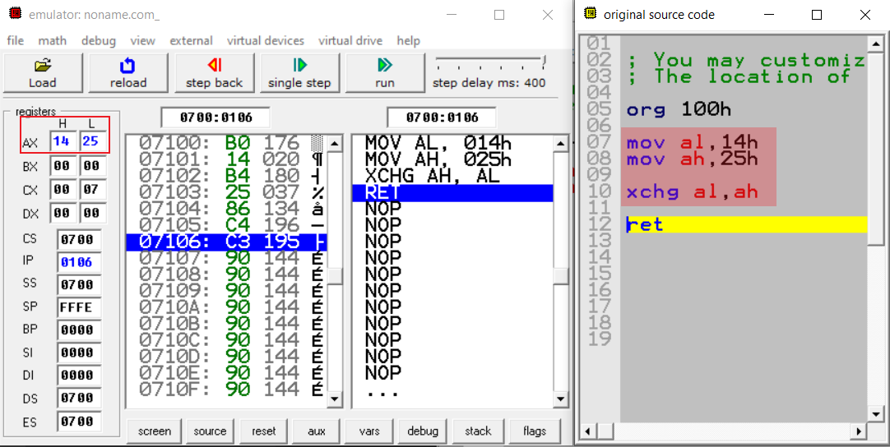
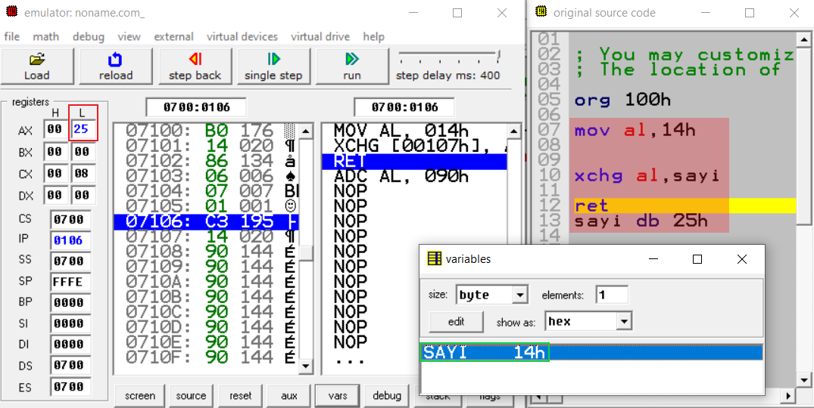
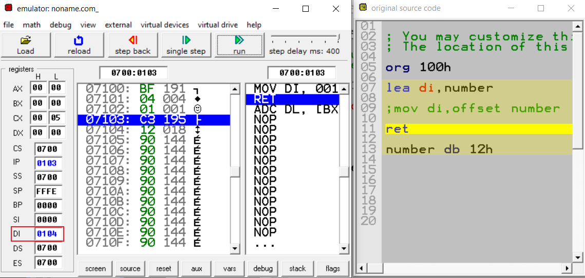
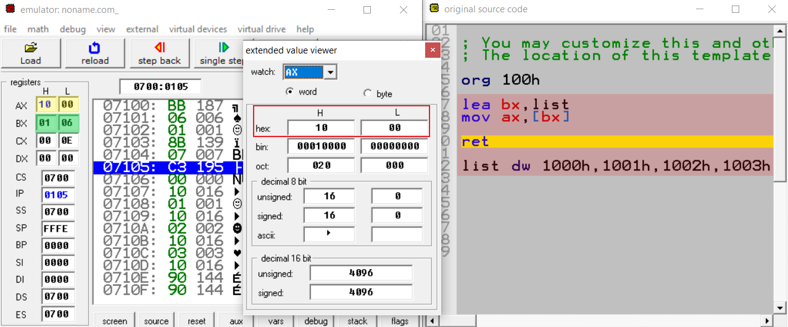
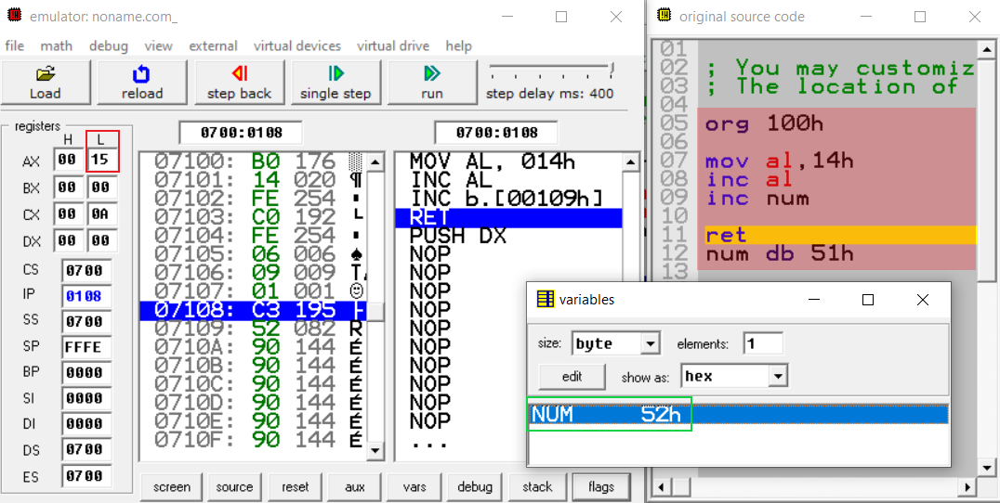
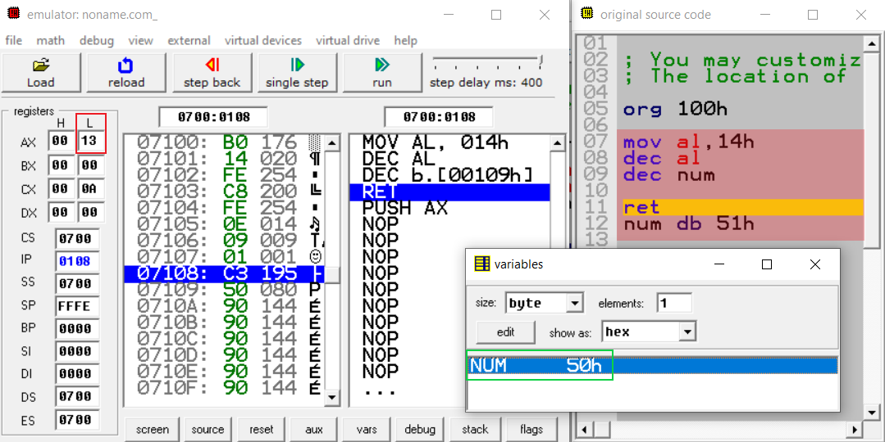
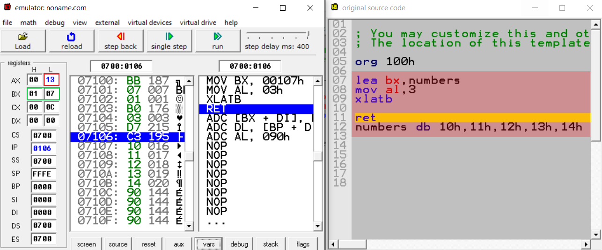
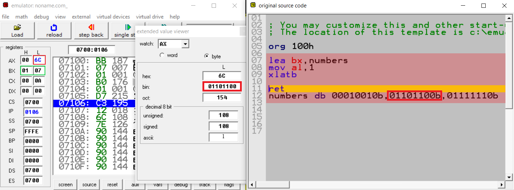

# Temel Assembly Komutları

## MOV Komutu

MOV komutunun temel işlevi kopyalamaktır. Kaynaktan hedefe doğru bir kopyalama işlemi yapar. MOV komutu bayrakları etkilemez.

```
MOV hedef,kaynak
```

Buradaki hedef verilerin aktarılacağı adresi, kaynak ise aktarılacak olan veriyi ifade etmektedir. Bu aktarım yapılırken kaynaktaki değer kaybolmaz.

### MOV komutunun kullanım şekilleri
```
hedef,kaynak

REG,memory
memory,REG
REG,REG
memory,immediate
REG,immediate
SREG,memory
memory,SREG
REG,SREG
SREG,REG
```
## Dikkat Edilmesi Gerekenler

1-Hafızanın bir konumunda diğer bir konumuna doğrudan taşıma
yapamazsınız. 

```
MOV memory,memory    -> yanlış bir kullanımdır.
```

Bu işlemi yapmak için taşınacak veri önce register'lardan birine aktarılmalıdır.

2-Hedef ve kaynak eşit boyutlarda olmak zorundadır. Biri 8 bit register iken diğeri 16 bit register olamaz.

```
MOV ax,al   -> yanlış bir kullanımdır.
MOV ax,bx   -> doğru bir kullanımdır.
``` 

3-Bir segment register değeri başka bir segment register içerisine direkt olarak atanamaz. Öncelikle genel kaydedicilere veri yüklenmelidir. Ayrıca segment kaydedicilere doğrudan bir veri taşıyamayız.

```
MOV ds,es   -> yanlış bir kullanımdır.
MOV ds,654h -> yanlış bir kullanımdır.
```  
4-Segment kaydedicilerine sadece
16 bitlik boyutunda değerler yüklenebilir. Genel kaydedicilerin 16 bitlik kısımları kullanılmalıdır(ax,bx vb..)

```
MOV ds,al  -> yanlış bir kullanımdır.
MOV ds,ax  -> doğru bir kullanımdır.
```  
5-CS ve IP kaydedicilerinin değerlerini ayarlamak için kullanılamaz.

## Örnekler
  

Burada görüldüğü üzere ilk olarak **58h** değeri 8 bitlik bir register olan al'ye aktarılıyor. Daha sonra içerisinde **58h** değeri bulunan al, 8 bitlik ah registerine kopyalanıyor.


byte cinsinden içerisinde **55h** değerini tutan bir number değişkenimiz var. Number değişkeninin tuttuğu **55h** değeri mov ile bl değişkenine kopyalanıyor, daha sonra bl değişkeninde bulunan **55h** değeri al registerine kopyalanıyor.

## XCHG Komutu

XCHG(exchange) yani yer değiştirme komutu operandlar arası yer değişikliği yapar. XCHG komutu bayrakları etkilemez.

```
XCHG operand1,operand2
```
operand1'deki değeri operand2'ye, operand2'deki değeri operand1'e aktarır.

### XCHG komutunun kullanım şekilleri
```
operand1,operand2

REG,memory
memory,REG
REG,REG
```

## Örnekler



al registerine `14h` değeri, ah registerine ise `25h` değeri aktarılıyor. Daha sonra XCHG komutu ile al'deki değer ile ah'deki değer yer değiştiriyor.



Bu örnekte ise ilk olarak al registerine `14h` değeri aktarılıyor. Daha sonra XCHG komutu ile al registeri içerisindeki değer ile sayi degiskeni içerisindeki değer yer değiştiriyor. sayi değişkeni içerisine `14h`, al registerinin içerisine ise `25h` değeri aktarılıyor.

## LEA Komutu

LEA(Load Effective Address) komutunun temel işlevi kaynaktaki offset adresini(başlangıç adresini) hedefe yükleyen komuttur. LEA komutu bayrakları etkilemez.

```
LEA hedef,kaynak
```
kaynak içerisindeki başlangıç adresi LEA komutu sayesinde hedef adrese aktarılır.

### LEA komutunun kullanım şekilleri
```
hedef,kaynak

REG,memory
```
## Dikkat Edilmesi Gerekenler

1-Başlangıç adres tutucuları olan bx,bp ve indeks kaydedicileri si,di kullanılmalıdır.

2-LEA komutu ile elde edilecek veri 16 bit uzunluğunda olduğu için hedef  mutlaka word tipinde bir register olmalıdır.

```
LEA al,number   -> yanlış bir kullanımdır.
LEA bx,number   -> doğru bir kullanımdır.
``` 

## Örnekler



byte cinsinden içerisinde **12h** değerini tutan bir number değişkenimiz var. Number değişkeninin başlangıç adresi görüldüğü üzere LEA komutu sayesiyle di registeri içerisine atılıyor. Bunu yapmanın bir farklı yöntemi ise yorum satırı ile göstermiş olduğumuz `MOV di,offset number` ile number değişkeninin başlangıç adresini `offset number` ile alıp mov komutu ile di içerisine atabilmekteyiz.

> Yeri gelmişken söyleyelim Assembly'de ; (noktalı virgül) ile yorum satırı oluşturulabilir.



Bu örnekte ise list isimli dizinin başlangıç adresi bx registeri içerisine alınıyor. Daha sonra `[bx]` ile başlangıç adresinde bulunan değer ax registerine kopyalanır. Görüldüğü üzere ax registerinin içerisinde list dizisinin ilk elemanı olan `1000h` değeri kopyalanmıştır.

## INC Komutu

INC(Increment) komutu registerları veya memorydeki herhangi bir değeri 1 arttırır. ADD komutuna benzer bir işlevi vardır. Carry Flag(elde bayrağı - CF) dışında diğer bayraklar etkilenir.

```
INC reg or memory
```

## Dikkat Edilmesi Gerekenler

1-Anlık değerlerde arttırma işlemi yapılamaz(Örn: 5,42h,11000001b vb.)
```
INC 20h   -> yanlış bir kullanımdır.
``` 

## Örnek



al değişkenine `14h` değeri aktarılıyor ardından INC ile al registeri içerisindeki değer 1 arttırılıyor ve al registeri içerisindeki değer `15h` oluyor. Daha sonra num değişkeni INC komutu ile 1 arttırılarak `52h` değerini alıyor.

## DEC Komutu

DEC(Decrement) komutu registerları veya memorydeki herhangi bir değeri 1 azaltır. Carry Flag(elde bayrağı - CF) dışında diğer bayraklar etkilenir.

```
DEC reg or memory
```

## Dikkat Edilmesi Gerekenler

1-INC komutunda olduğu gibi anlık değerlerde eksiltme işlemi yapılamaz.
```
DEC 11100101b   -> yanlış bir kullanımdır.
``` 

## Örnek

INC komutunda kullandığımız örneğin aynısını DEC için de yapalım.



al değişkenine `14h` değeri aktarılıyor ardından DEC ile al registeri içerisindeki değer 1 azaltılıyor ve al registeri içerisindeki değer `13h` oluyor. Daha sonra num değişkeni INC komutu ile 1 azaltılarak `51h` değerini alıyor.

## XLAT/XLATB Komutu

XLAT/XLATB(Translate byte) komutunu genelde bir dizideki elemanı al kaydedicisine çekmek istediğimiz zaman kullanırız.
Komutun işleyişi şu şekildedir; ilk olarak istenen elemanın konumu al kaydedicisine çekilir, aynı zamanda da bx içerisinde de dizinin başlangıç adresi bulunması gerekmektedir. XLAT/XLATB komutu bayrakları etkilemez. Örnekler üzerinden daha iyi anlaşılacaktır.

```
XLATB   -> Herhangi bir operand almaz. Sade şekilde kullanılır. 
```
## Örnekler



Örneği açıklayacak olursak ilk olarak bx registerisi içerisine numbers isimli dizinin başlangıç adresi aktarıldı. Daha sonra numbers dizisinde hangi elemana ulaşmak istiyorsak o elemanın index numarasını al registerisi içerisine aktardık. Ardından XLATB komutunu da yazdık. Sonuç olarak al registerisi içerisine numbers dizisinin 3. indexi olan `13h` aktarıldı.



Buradaki örnekte ise binarylerden oluşan bir numbers dizimiz mevcut. Bu dizinin başlangıç adresini bx registerisi içerisine aktarıyoruz. Daha sonra numbers dizisinde hangi elemana ulaşmak istiyorsak o elemanın index numarasını al registerisi içerisine aktardık. Ardından XLATB komutunu da yazdık. Sonuç olarak numbers dizisinin 1. indexinde bulunan  `01101100b` değeri al registeri içerisine aktarıldı.