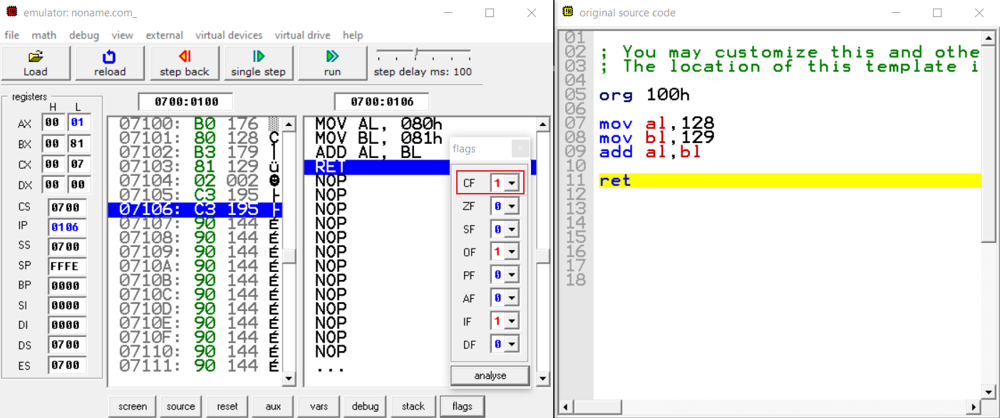
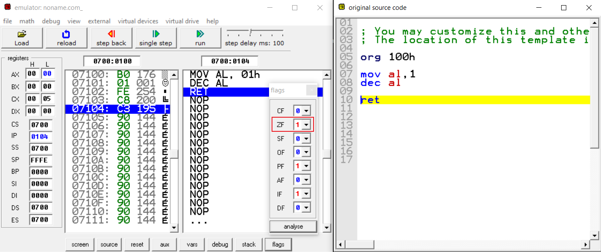
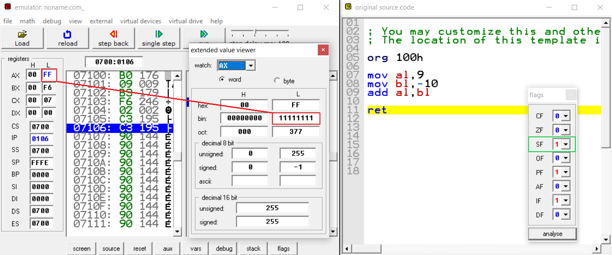
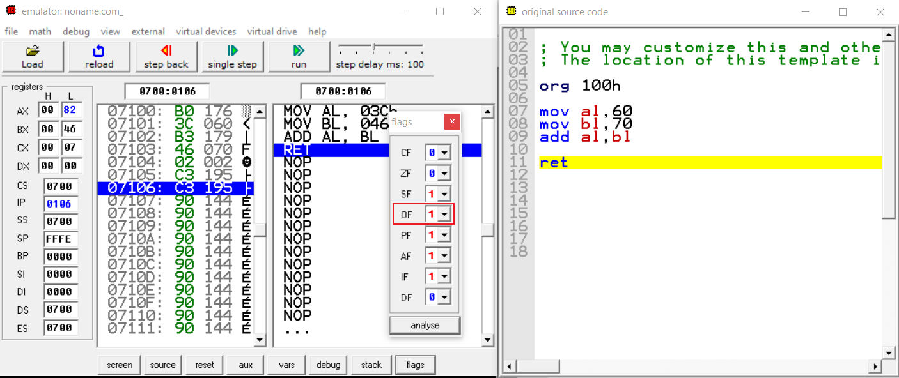
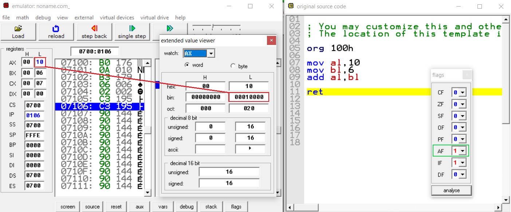

# Bayraklar(Flags)

## Carry flag(CF)

İşaretsiz(unsigned) sayılarla yapılan işlemler sonucunda bir **taşma söz konusu ise** bu bayrak 1 yani aktif, taşma meydana gelmiyor ise 0 yani pasiftir.
8 bitlik bir ifade için işaretli sayılar bilindiği gibi 0-255 arasındadır. 255 + 1 gibi bir toplama işlemi durumunda taşma meydana gelecektir. Çünkü 256 değeri 8 bitlik bir register ile ifade edilemez.

Örnekte de görüldüğü üzere al 8 bitlik bir register ve al 0-255 arasında değerler alabilir. al ile bl'yi ADD komutu ile  toplayıp al registerine attığımız zaman bir taşma oluyor ve **carry flag** aktifleşiyor.

## Zero flag(ZF)

Herhangi bir işlem sonucunda sıfır değeri elde ediliyorsa bu bayrak 1 yani aktif eğer işlemin sonucu sıfır değilse bu bayrak 0 yani pasif olur. İki değerin eşit olup olmama durumu bu bayrak sayesinde anlaşılabilir.

Buradaki örnekte al registerisi içerisine 1 aktarıldıktan sonra DEC komutu ile  al registerisi 1 azaltıldı ve al registerisi 0 oldu. Bu yüzden zero flag aktif oluyor.

## Sign flag(SF)

Aslında en basit ifade ile bu bayrak işlem sonucunda elde edilen değerin en soldaki bitini yani işaret bitini tutuyor. İşlem sonucunda elde edilen değerin işaret bit'i 0 ise bu bayrak pasif, 1 ise aktif oluyor. Biz bir aritmetik işlemde **sonucun negatif olup olmadığını** bu bayrak sayesinde anlayabiliriz. 

Örnekte al registeri içerisindeki 9 değeri ile bl registeri içerisindeki -10 değeri toplanıp al registerisine yazıldı, binary değeri `11111111` olan ve en soldaki biti yani işaret biti 1 olduğu için bu bayrak aktif durumdadır.

## Overflow flag(OF)

**İşaretli** sayılarda yapılan işlemin sonucu işaretli sayı aralığında ise 0 yani pasif ama bir aşma durumu var ise 1 yani aktif olur.

8 bitlik işaretli sayılarda **en küçük değer -128 en büyük ise +127'dir.** Burada al ile bl toplamı olan 130, al registerisine aktarıldı. İşlemin sonucu işaretli sayı aralığını aşdığı için bu bayrak 1 yani aktif durumdadır. 

## Parity flag(PF)

İşlemin sonucundaki değerdeki aktif(1) olan bitlerin sayısı çift sayı ise bu bayrak 1 yani aktif eğer işlemin sonucundaki değerde aktif(1) olan bitlerin sayısı tek ise bu bayrak 0 yani pasif olur. Elimizdeki sonuç 16 bitlik bile olsa sadece düşük değerli 8 bit ele alınmalıdır.
Biraz karışık bir ifade olabilir. Örnekle daha iyi pekişecektir...

Burada al registerindeki 8 değeri ile bl registerindeki  9 değeri toplanıp al registerine yazıldı sonucun binary değeri `00010001` yani burada aktif(1) olan bitlerin sayısı 2 adet yani çift sayıdır. Bu yüzden parity flag aktif oluyor.

## Auxiliary carry flag(AF)  

İşaretsiz(unsigned) sayılarda yapılan işlem sonucunda 4 bit'te taşma meydana geliyorsa Auxiliary carry flag 1 yani aktif eğer taşma meydana gelmez ise 0 yani  pasif olur.

Burayı şöyle düşünelim al registerisine 10 değerini atadık yani `00001010`, bl registerisine ise 6 değerini atadık yani `00000110`, ikisini toplayıp(10 + 6 = 16) al registerisine atadık. Bilindiği üzere **4 bit 0-15 arasındaki sayılar ile ifade ediliyordu.** `00001010 + 00000110 = 00010000` görüldüğü gibi düşük değerli 4 bit'te taşma meydana geldi ve bu bayrak aktif duruma geçti.

## Interrupt enable Flag(IF)

**Default olarak 1 değeri vardır.** 1 yani aktif durumda iken işlemciye harici cihazlardan kesme(interrupt) sinyalleri gönderilebilir.

## Direction Flag (DF)

Ardışık verilerde özellikle string işlemlerinde kullanılan komutların **ileri mi geri yönlü mü çalışacağını belirlemektedir.** Direction flag 1 ise geri yönlü 0 ise ileri yönlü işlem yapılır.