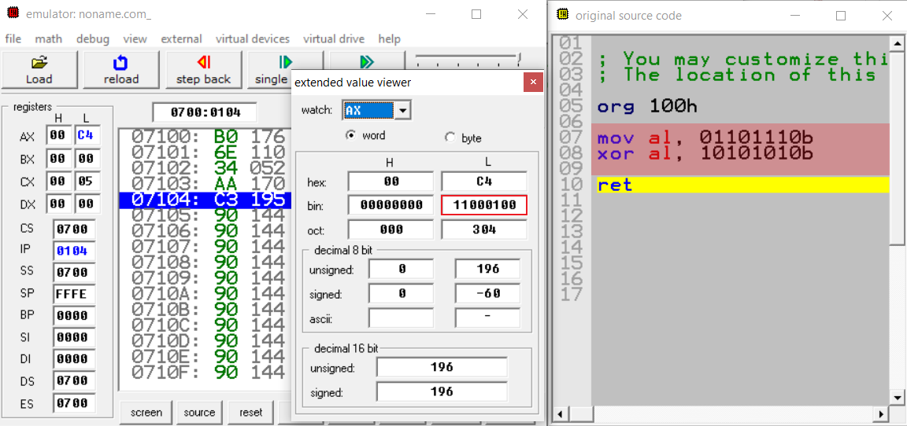

# Mantıksal Komutlar

## AND(ve) Komutu
```
AND deger1,deger2   
```
AND(ve) komutu deger1 ile deger2'yi mantıksal ve işlemine tabi tutar, çıkan sonuç deger1 içerisinde saklanır. Genelde maskeleme için elektronikçiler tarafından çokca kullanılır. Örneklere geçtiğimizde 

## Mantıksal AND(ve) işlemi
```
1 ve 1 = 1
1 ve 0 = 0
0 ve 1 = 0
0 ve 0 = 0
```

## AND komutunun kullanım şekilleri
```
deger1,deger2

reg,memory
memory,reg
reg,reg
memory,immediate
reg,immediate
```

## Örnekler 


Bu örneği açıklayacak olursak al registeri içerisine `s` degeri yani `01110011` aktardık. Daha sonra bl registeri içerisine `11011111` degerini aktardık. Daha sonra al ile bl registerleri arasında mantıksal ve işlemi gerçekleştirdik. Bu iki registerdeki degerlerin her biti kendi aralarında mantıksal ve işlemi gerçekleştirdi. Sonuç olarak `01010011` değeri elde edilir. Aslında burada bir nevi  harfin büyük halini elde ediyoruz. 

Şimdi gelelim neden `11011111` degerini kullandık. Farkedeceğiniz gibi sadece 5. biti 0, bu da demek oluyor ki karşısında hangi deger olursa olsun 5. bitini maskeleyecek yani 0 yapacaktır. 5. bitin degeri bilindiği üzere 2⁵ yani 32, burada s nin decimal değeri `115`, büyük S nin decimal değeri ise `83` dir. Yani bizim küçük s harfinden büyük S harfini elde etmek için 32 çıkarmamız gerek, bu da 5. biti maskelemek anlamına geliyor. 

```
115 - 83 = 2⁵ = 32 
```


Buradaki örnekte ise al registeri içerisine aktardığımız `57h` yani `01010111` değerinin yüksek degerli 4 bitini(yani 4, 5, 6 ,7) maskelemek istiyoruz. Bunun için yapmamız gereken al registerini `00001111` ile mantıksal ve işlemine tabi tutmak. Sonuç olarak yüksek değerli 4 bit maskelenerek `00000111` değeri elde edilir.

## OR(veya) Komutu
```
OR deger1,deger2   
```

OR(veya) komutu deger1 ile deger2'yi mantıksal veya işlemine tabi tutar, çıkan sonuç deger1 içerisinde saklanır. AND komutuna benzerdir. İstenilen bitleri korumak için kullanılabilir.

## Mantıksal OR(veya) işlemi
```
1 veya 1 = 1
1 veya 0 = 1
0 veya 1 = 1
0 veya 0 = 0
```

## OR komutunun kullanım şekilleri
```
deger1,deger2

reg,memory
memory,reg
reg,reg
memory,immediate
reg,immediate
```

## Örnekler 


Yukarıdaki AND komutu için yaptığımız ilk örneğin çok benzeri bir örnek. İlk olarak al registerine büyük S yani `01010011` değerini aktardık. Ardından bl registerisi içerisine `00100000` değerini atadık. Daha sonra al ve bl registerleri arasında mantıksal veya işlemi gerçekleştirdik. Sonuç olarak küçük s yani `01110011` değerini elde ettik. Aslında burada bir nevi  harfin küçük halini elde ediyoruz.

Şimdi gelelim neden `00100000` değerini kullandık. Yukarıdaki örnekte 32 eksiltmeye çalışıyorduk. Burada ise tam tersi 32 arttırmaya çalışıyoruz. Bunun için ise beşinci biti 1, diğerlerini 0 olarak verdik. Bunun temel olarak sebebi mantıksal veya işleminde bir değeri 0 ile işleme tabi tuttuğumuzda sonuç her zaman 0'ın karşısına gelen sonuç olur. Yani 1 ise 0 or 1 = 1, eğer 0 ise 0 or 0 = 0 sonucunu elde edeceğiz. Bu yüzden 0 olan bitler mantıksal veya işlemine uğradığında karşısında hangi değer(0 veya 1) varsa o değeri alacaktır fakat 5. bitte 1 olduğu için karşısında ister 0 olsun ister 1 olsun sonuç her zaman 1 olarak kalacaktır.

```
83 + (2⁵ = 32) = 115 
```

## XOR(özel veya) Komutu
```
XOR deger1,deger2   
```

XOR, eXclusiveOR kısaltmasıdır. Aynıysa 0, farklısya 1 çıktısı verir. Bir nevi seçilen bitlerin tersini alır. Veri paketleme ve şifreleme alanı başta olmak üzere birçok alanda kullanılır.

## Mantıksal XOR(özel veya) işlemi
```
1 xor 1 = 0
1 xor 0 = 1
0 xor 1 = 1
0 xor 0 = 0
```

## XOR komutunun kullanım şekilleri
```
deger1,deger2

reg,memory
memory,reg
reg,reg
memory,immediate
reg,immediate
```

## Örnek



Bu örnekte yaptığımız işlem gayet basit ve anlaşılır. İlk olarak al registerine `01101110` değerini aktarıyoruz. Daha sonra bu değeri `10101010` değeri ile mantıksal xor işlemine tabi tutuyoruz. Aynı değerdeki bitler 0, farklı değerdeki bitler 1 sonucunu veriyor.

```
01101110 ^ 10101010 = 11000100
```

## NOT(değil) Komutu
```
NOT deger1
```

NOT komutu mantıksal değil işlemini gerçekleştirir. 1 ise 0, 0 ise 1 değeri üretir. Gayet basit bir komuttur.

## Mantıksal NOT(değil) işlemi
```
1 not = 0
0 not = 1
```

## NOT komutunun kullanım şekilleri
```
deger1

reg
memory
```

## Örnek


Burada görüldüğü üzere `11110000` değerini mantıksal değil işlemine tabi tuttuk. NOT komutu sayesinde bitlerin tam tersi alındı. Sonuç olarak `00001111` değeri elde edildi.

## TEST Komutu
```
TEST deger1,deger2
```

deger1 ve deger2 AND işlemi uygulanır fakat burada farklı olan şey, sonucun herhangi bir yerde saklanmamasıdır. Bu işlemden sadece bayraklar etkilenir. Test komutunun yalnızca bayrakları etkilemesi sebebiyle hemen ardından Şartlı dallanma komutu kullanılarak işlem yapılır. TEST komutundan sonra Carry Flag(cf) ve Overflow flag(of) reset edilirler. Auxiliary carry flag(AF) dışında diğer bayraklar işlem sonucuna uygun şekilde etkilenirler.

## TEST komutunun kullanım şekilleri
```
deger1,değer2

REG, memory
memory, REG
REG, REG
memory, immediate
REG, immediate
```

## Örnek


Örnektede  görüldüğü gibi al registerindeki değer etkilenmiyor sadece bayrakların durumu değişiyor.
